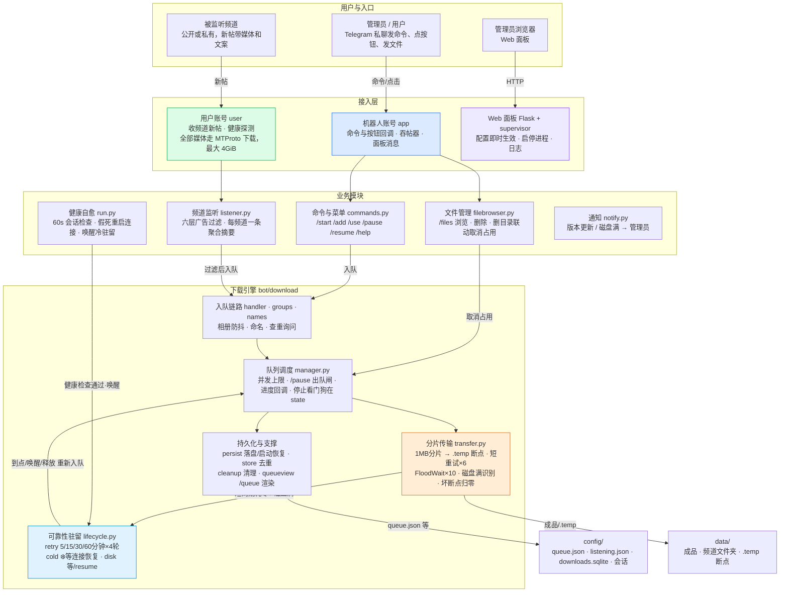

# 项目结构说明

这是一个 Telegram 文件下载机器人。日常用法是运行 `python start.py`，浏览器打开 http://127.0.0.1:8080 配置并启动机器人。

## 业务架构总览



接入层是双账号分工：机器人只管交互，另有吞帖器防止频道帖被误当私聊文件；媒体一律由用户账号走 MTProto 下载。业务模块提供命令、监听过滤、文件管理和自愈，notify 负责把版本更新和磁盘满通知发给管理员。下载引擎由可靠性驻留和持久化支撑兜底——断点和任务记录在任何自动中断下都保留，连接恢复后自动唤醒续传；成品落在 `data/`，任务和配置落在 `config/`。

## 目录总览

```text
tg-bot-dl/
├── start.py                 项目入口，启动网页配置面板
├── requirements.txt         Python 依赖列表
├── Dockerfile               镜像构建
├── docker-compose.yml       一键构建并启动容器
├── .dockerignore            构建时忽略本地缓存和配置
├── README.md                使用说明
├── STRUCTURE.md             本文件，项目结构说明
├── LICENSE                  开源许可证，MIT
│
├── web/                     网页配置面板
│   ├── server.py            网站服务和接口
│   ├── settings.py          读写配置
│   ├── supervisor.py        负责拉起/停止机器人进程
│   └── templates/
│       └── index.html       配置页面
│
├── bot/                     Telegram 机器人
│   ├── app.py               读取配置，创建 Telegram 连接
│   ├── version.py           应用名、版本号、上报给 TG 的设备信息
│   ├── run.py               机器人启动与退出
│   ├── callbacks.py         按钮回调协议：前缀常量与注册制路由
│   ├── commands.py          /start /help 等命令和中文回复
│   ├── folder.py            当前下载目录
│   ├── filebrowser.py       /files 浏览和删除已下载的文件
│   ├── listener.py          /listen 频道监听自动下载与广告过滤、按频道聚合摘要
│   ├── sysinfo.py           磁盘空间信息
│   ├── util.py              管理员校验、文件大小/时间格式化、管理员会话解析
│   └── download/
│       ├── handler.py       收到文件后加入下载队列
│       ├── names.py         文件名、后缀、分组文件夹命名
│       ├── groups.py        一组文件（相册）收齐后再一起处理
│       ├── fileformat.py    按文件真实格式校正后缀
│       ├── transfer.py      可续传分片下载：失败重试、耗尽长周期重排、磁盘满识别、坏断点归零
│       ├── manager.py       下载调度循环与单任务执行
│       ├── state.py         共享内存状态：排队/在途任务、批次、驻留表、停止标记、事件回调
│       ├── lifecycle.py     任务终结与驻留生命周期：停止/失败/长周期重排/冷驻留/磁盘满
│       ├── batches.py       批次与任务进度消息编排
│       ├── dedup.py         重复文件询问交互
│       ├── restore.py       进程重启后的队列恢复
│       ├── queueview.py     /queue 队列视图与取消回调
│       ├── render.py        进度/批次面板的文本渲染与消息编辑辅助
│       ├── cleanup.py       停止后的文件清理与残留重试
│       ├── persist.py       下载任务持久化（config/queue.json）与启动恢复
│       ├── store.py         用 SQLite 记录已下载文件，避免重复下载
│       └── types.py         下载任务和分组任务的数据结构
│
├── config/                  运行时配置和登录状态，不要提交到公开仓库
│
└── data/                    下载文件保存目录
```

## 启动关系

```text
python start.py
        │
        ▼
   web/server.py          打开网页 http://127.0.0.1:8080
        │
        ▼
   web/supervisor.py      点「启动」或「保存并生效」后
        │
        ▼
   python -m bot.run
        │
        ├── bot/app.py           连上 Telegram（走配置里的代理）
        ├── bot/commands.py      注册命令
        └── bot/download/manager.py  后台排队下载
```

网页只负责配置和开关。真正收消息、下文件的是 `bot/`。

## 根目录文件

| 文件 | 作用 |
| :--- | :--- |
| `.gitignore` | 忽略缓存、登录会话、网页配置和已下载文件，避免提交进去。 |
| `start.py` | 唯一推荐入口。启动网页配置面板。 |
| `requirements.txt` | 安装依赖：`pip install -r requirements.txt`。 |
| `Dockerfile` | 构建运行镜像，Python 3.13，默认 `/data`、`/config`。 |
| `docker-compose.yml` | 构建镜像、映射端口和本地 `data/`、`config/` 目录。 |
| `.dockerignore` | 避免把本地会话、下载文件打进镜像。 |
| `README.md` | 功能介绍、配置项、机器人命令。 |
| `STRUCTURE.md` | 目录和文件职责说明。 |
| `LICENSE` | MIT 许可证。 |

## web/ 网页面板

| 文件 | 作用 |
| :--- | :--- |
| `web/server.py` | Flask 网站。提供页面、查看状态、保存配置、启动/停止机器人、提交验证码。 |
| `web/settings.py` | 把网页表单读写到 `config/settings.env`，并检查必填项。 |
| `web/supervisor.py` | 用子进程运行 `python -m bot.run`，收集日志，识别「等待验证码」等状态。 |
| `web/templates/index.html` | 浏览器里看到的配置页、状态、日志。 |

常用接口：

- `GET /` 配置页
- `GET /api/status` 运行状态和日志
- `POST /api/settings` 保存配置并重启机器人
- `POST /api/start` 和 `POST /api/stop` 启动或停止
- `POST /api/input` 提交验证码或二次验证密码

## bot/ 机器人

| 文件 | 作用 |
| :--- | :--- |
| `bot/app.py` | 读取环境变量和 `config/settings.env`，创建机器人客户端 `app`，填了手机号再创建用户客户端 `user`。代理也在这里生效。 |
| `bot/callbacks.py` | 按钮回调的前缀常量与注册制路由：各功能模块导入时注册处理器，dispatch 按前缀长度匹配。 |
| `bot/version.py` | 应用名、版本号，以及上报给 Telegram 的设备信息。 |
| `bot/run.py` | 启动顺序：注册命令 → 登录 → 启动下载队列 → 等待消息。另有会话健康检查：连接假死时自动重启连接，进程和下载队列不动，传输断点续传。 |
| `bot/commands.py` | `/start`、`/help`、`/usage`、`/use`、`/add`、`/queue`、`/pause`、`/resume`、`/files`、`/listen`、`/listening`，以及命令菜单。 |
| `bot/folder.py` | 记住当前保存目录。`/use` 切换，`/leave` 回到 `data/`。 |
| `bot/filebrowser.py` | `/files` 的目录浏览、进入子目录/返回上级、文件删除，删除有二次确认。 |
| `bot/listener.py` | `/listen` 频道监听自动下载：每频道文件夹、广告过滤（关键词 + 上游正则组合规则 + 可疑文件识别）、管理员会话按频道聚合摘要。 |
| `bot/sysinfo.py` | 给 `/usage` 提供磁盘容量、已用、剩余空间。 |
| `bot/util.py` | 只允许管理员使用；把字节和秒转成可读的大小、时间；解析管理员会话，通知都发到这里。 |

### bot/download/ 下载

| 文件 | 作用 |
| :--- | :--- |
| `handler.py` | 用户发来文件，或 `/add` 通过链接取到文件后，加入下载队列。一组文件会放进同一个文件夹。 |
| `names.py` | 生成文件名、补后缀、给一组文件起文件夹名。 |
| `groups.py` | 等一组文件到齐后再一起处理。 |
| `fileformat.py` | 下载完成后按文件真实格式校正后缀，不改文件内容。 |
| `transfer.py` | 可续传下载：按 1MB 分片拉取，失败保留 `.temp` 并从偏移重试；短周期重试耗尽抛 `DownloadExhausted` 交由上层长周期重排，写盘 ENOSPC 带磁盘满标记，坏断点归零重下。 |
| `manager.py` | 调度循环：按并发上限取出任务、执行 `downloadFile`、核对大小、写去重记录、广播事件。停止看门狗在 `state.py`。 |
| `state.py` | 全部共享内存状态的唯一出处：排队/在途任务、批次、改名目标、驻留表、停止标记、查重在飞集合、事件回调列表；附带入队、驻留读写、停止标记等轻量操作。 |
| `lifecycle.py` | 决定任务何时真正结束：手动停止和源消息删除才判死；短周期重试耗尽转长周期重排，5/15/30/60 分钟最多 4 轮，轮次用尽转冷驻留等连接恢复；磁盘写满驻留并暂停队列。含批次与单任务停止入口。 |
| `batches.py` | 批次与任务进度消息编排：刷新、批次收尾含空目录清理、停止前的清理等待、开始下载提示。 |
| `dedup.py` | 重复文件的两次询问：入队前唯一 ID 拦截弹窗、下载后内容哈希相同弹窗，以及继续/跳过/保留/删除四个决策。 |
| `restore.py` | 进程重启后的队列恢复：读 `queue.json` 重建批次与任务、重取源消息，`.temp` 断点自动生效；无法恢复的顺带清理断点。 |
| `queueview.py` | `/queue` 的队列视图：渲染任务列表、取消回调（复用 manager 的停止逻辑）。 |
| `render.py` | 进度条、批次/条目状态文案、键盘按钮、限流冷却下的消息编辑——纯函数，manager 与 queueview 共用。 |
| `cleanup.py` | 停止后的文件/文件夹清理，句柄占用时的后台重试删除。 |
| `persist.py` | 下载任务持久化到 `config/queue.json`（入队即落盘），进程重启后恢复任务并断点续传。 |
| `store.py` | 本地 SQLite 记录 file_unique_id 和文件哈希，下载前/后拦截重复。 |
| `types.py` | 单个下载任务、一组文件的共享状态，以及状态字和驻留原因的枚举。 |

下载走的是 `bot/app.py` 里创建的同一个 Telegram 连接，因此配置了代理时，下载也会走代理。

有两种下载来源：

1. 直接把文件发给机器人 → 用机器人客户端 `app`
2. `/add 消息链接` 下载禁止转发的内容 → 用用户客户端 `user`（需要手机号登录）

## config/ 和 data/

这些是运行后产生的数据，不是源代码。

| 路径 | 作用 | 能否删除 |
| :--- | :--- | :--- |
| `config/settings.env` | 网页保存的配置 | 删除后要重新填写 |
| `config/web.secret` | 面板会话密钥 | 删除后已登录的面板会失效，会自动再生成 |
| `config/TDownloader-bot.session` | 机器人登录状态 | 删除后机器人要重新登录 |
| `config/TDownloader-user.session` | 用户账号登录状态 | 删除后要重新收验证码 |
| `config/downloads.sqlite` | 已下载文件的查重记录 | 删除后无法拦截历史重复文件 |
| `config/queue.json` | 未完成下载任务的落盘 | 空的时候会被自动重建 |
| `data/` | 下载完成的文件 | 删除只影响已下载文件 |

## 修改时看哪里

| 你想改什么 | 去哪个文件 |
| :--- | :--- |
| 机器人回复的中文文案 | `bot/commands.py`、`bot/download/handler.py`、`bot/download/manager.py`、`bot/util.py` |
| 下载队列（/queue）的展示和取消 | `bot/download/queueview.py` |
| 文件管理（/files）的浏览和删除 | `bot/filebrowser.py` |
| 频道监听与广告过滤（/listen） | `bot/listener.py` |
| 任务持久化与重启恢复 | `bot/download/persist.py`、`bot/download/restore.py` |
| 网页外观和输入框 | `web/templates/index.html` |
| 配置项有哪些 | `web/settings.py` |
| 启动方式、代理、Telegram 客户端 | `bot/app.py` |
| 下载进度、停止按钮 | `bot/download/render.py`、`bot/download/batches.py` |
| 失败重试 / 断点保留 / 冷驻留 | `bot/download/lifecycle.py`、`bot/download/transfer.py` |
| 重复文件询问文案与逻辑 | `bot/download/dedup.py` |
| 共享状态字段 | `bot/download/state.py` |
| 文件名规则 | `bot/download/handler.py` |
